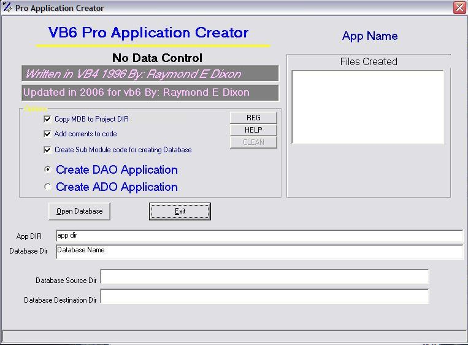



## VB6ProApplicationCreator

### Description

Builds complete ADO ot DAO application for all

tables,queries and fields in Access database.mdb

including code to recreate database
 
### More Info
 
database.mdb

ADO ot DAO application

             |
---                |---
**Submitted On**   |2007-01-20 01:16:22
**By**             |[Raymond Dixon](https://github.com/Planet-Source-Code/PSCIndex/blob/master/ByAuthor/raymond-dixon.md)
**Level**          |Beginner
**User Rating**    |4.7 (33 globes from 7 users)
**Compatibility**  |VB 6\.0
**Category**       |[Databases/ Data Access/ DAO/ ADO](https://github.com/Planet-Source-Code/PSCIndex/blob/master/ByCategory/databases-data-access-dao-ado__1-6.md)
**World**          |[Visual Basic](https://github.com/Planet-Source-Code/PSCIndex/blob/master/ByWorld/visual-basic.md)
**Archive File**   |[VB6ProAppl2043501202007\.zip](https://github.com/Planet-Source-Code/raymond-dixon-vb6proapplicationcreator__1-67682/archive/master.zip)

